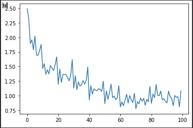

# Attention is All you Need(Transformer)実装

transformerの実装を行う。

## ToDo

- EncoderDecoderの出力の形の確認 (done)
- モデル内でのmaskの挙動

## バグ修正

### 勾配が0になる問題

- transformer.gen.linear.weight.grad
  - ここは普通に勾配あった
- transformer.enc_dec.decoder.layers[5].feedforward.l2.weight.grad
  - 勾配がNone
- ransformer.enc_dec.encoder.layers[0].multi_attention.linear_q.weight.grad
  - もちろん勾配None

#### 原因

decoder_layerで、エンコーダの入力を入れるattentionで間違えて上と同じattention layerを用いていた

---

- Tips
  - ```transformer.state_dict()["gen.linear.weight"].grad```
    - 理由はわからないが、state_dictを使ってパラメータを取得すると、gradがNoneになる

### 損失関数について

- nn.CrossEntropyと自作の交差エントロピー誤差の計算結果が違う。
  - 収束も最終的なlossの大きさも、自作の方が早く、小さい値をとる
  - なんでだろうー？
  - ベクトルの形が少し違うから、計算方法がいつもと変わって所望の計算をしてない可能性？
  - 試してみる必要がある。

### 生成関数について

- 学習済みのデータすら再現できない
  - autoregressiveな部分の実装がおかしい
  - 多分解決？

### loss減らない再び

- 微妙には減っている
  - 損失関数というよりも、内部の構造的にへんな作りになっていて、うまく学習できていない可能性

## regenerate data

ランダムに発生させたデータセットを作成し、そのデータを復元するタスク

### results

最後のイテレーションの結果。[参照](train_regenerate.ipynb)

predcit
epoch : 9, itration : 9, loss : 1.0825093984603882  
tensor([2, 3, 6, 5, 8, 5, 3])  
tensor([5, 3, 6, 5, 8, 5, 2])  
eval  
tensor([2, 3, 6, 5, 8, 5, 3])  
tensor([5, 2, 3, 6, 8, 5, 2])  


